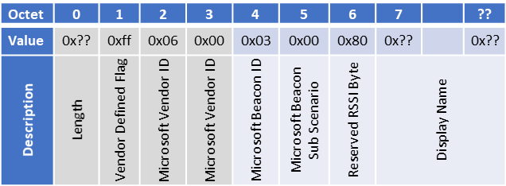

| Supported Targets | ESP32 | ESP32-C2 | ESP32-C3 | ESP32-H2 | ESP32-S3 |
| ----------------- | ----- | -------- | -------- | -------- | -------- |

# ESP-IDF BLE HID with Microsoft Swift Pair Feature Supported

- This example is modified from the official esp-idf examples [here](https://github.com/espressif/esp-idf/tree/master/examples/bluetooth/bluedroid/ble/ble_hid_device_demo).

- The swift pair function is implemented by following the payload structure determined by Microsoft as shown below

- You can find more information about Swift Pair [here](https://learn.microsoft.com/en-us/windows-hardware/design/component-guidelines/bluetooth-swift-pair)
